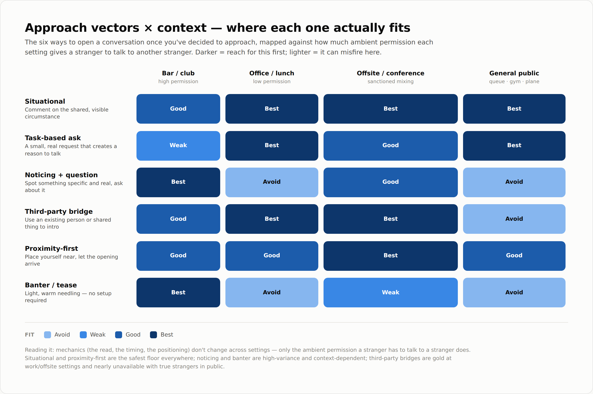

# Openers — the Situational Vector

Working notes on one approach vector: **situational** — commenting on the
obvious, shared thing in front of both of you. Covers the general framework,
the field-version checklist, the shape toolkit, and where situational sits
against the other five approach vectors.

---

## Where situational sits — approach vectors × context

Six ways to open once you've decided to approach, mapped against how much
ambient permission each setting gives a stranger to talk to a stranger.
Darker = reach for this first; lighter = it can misfire here.

Situational and Proximity-first are the only two rows that never hit "Avoid" —
they're the all-weather defaults. Noticing and Banter swing hardest by
setting. Third-party bridge is strong at work/offsite, nearly unusable with
true strangers in public.

---

## The general framework — how a situational line gets built

Four steps, run in order, every time:

1. **Scan for a shared, visible fact.** Something both people can perceive
   right now, with zero extra information about the other person. It lives
   in one of five places: the environment (room, view, noise), a shared
   friction (a wait, a delay, something broken/slow), a rule or system you're
   both subject to (a line, a badge gate, a seating rule), an object or third
   element present (a dog, the food, the weather), or timing (both early,
   both late, both first).
2. **Filter for neutrality.** The fact must be something nobody could
   disagree is happening, and it can't be a claim *about the person* yet —
   that's a different vector (noticing). "This line hasn't moved" passes.
   "You look bored" doesn't.
3. **Frame it as open, not closed.** A flat statement gives the other
   person nothing to do but nod. Use one of three shapes: a light question,
   a shared complaint framed as "us" not "this," or a wry prediction that
   invites correction. All three leave room for a reply.
4. **Deliver it short and wry, not clever.** One sentence, said like you'd
   mutter it to a friend — not performed, not a written punchline. Content
   barely matters here; delivery is what makes it sound like a person and
   not a script.

**Compressed:** notice a shared fact → confirm it's neutral, not about them
→ shape it as a question / shared gripe / wry prediction → say it short and
low-key.

---

## The field version — 3 questions, half a second each

For use live, when there's no time to compose from scratch:

1. **"What's the one thing happening right now that's true for both of
   us?"** — name it as a noun phrase, not a sentence yet.
2. **"Is that about the situation, or about them?"** — if it's about them,
   drop it; wrong vector.
3. **"Which shape does it fit?"** — pick from the toolkit below instead of
   inventing sentence structure from nothing.

---

## The shape toolkit — five templates, memorize the shape not the words

| Shape | Template | Use when |
|---|---|---|
| Prediction / gripe | "Of course ___ right when ___." | Bad timing, shared annoyance (something slow, jammed, delayed) |
| Coincidence callout | "Ha, looks like we both had the same idea." | Two people converging on one thing at once |
| Mock-stakes | "Well, someone's about to have a very productive afternoon and it's not gonna be me." | Playful, cedes the thing, self-deprecating |
| Short callback question | "___ again?" | Something recurring — a machine, a delay, a pattern |
| Cede-with-tease | "You go ahead — I'll just stand here looking productive." | One person has to lose/wait; keeps it light |

Field notes from live drilling:

- Good instinct, needs anchoring: reading the room's hierarchy/status before
  picking a register (e.g. checking if someone's senior before cracking a
  joke) is a real skill — but the line itself still has to anchor on the
  concrete object/moment in front of you, not drift into a general
  complaint. "Nothing works in this office" → drifted from the specific
  jammed printer into a generic gripe. Fix: keep the object as the anchor
  and leave it open — *"Of course it jams right when I need it."*
- Good content, wrong length: a strong comedic idea delivered in three
  sentences reads as a rehearsed bit, not a reaction. Compress to one line
  and let the joke survive the cut. ("They must be solving all our problems
  in there, we might not even need our meeting" → one sentence, same joke.)
- The pattern: content instincts are usually fine; the two recurring fixes
  are (a) anchor to the concrete thing in front of you, not the bigger idea
  it reminds you of, and (b) cut to one sentence, said like a mutter.

---

## Worked example — coworking space, shared outlet

**Situation:** you spot the one open desk with a working outlet; someone
else is walking toward it from the other side of the room at the same
moment.

- Step 1 (shared fact): we both clocked the same outlet at the same time.
- Step 2 (neutral?): yes — about the situation, not about either person.
- Step 3 (shape): this is a **coincidence callout** or **cede-with-tease**
  situation specifically — those two shapes exist for "two people converge
  on one limited thing."

---

## Expanded shape toolkit — borrowed from the Humor Development taxonomy

The plain five-shape toolkit above is a deliberate floor — safe, functional,
built for the moment your brain goes blank. It's not built for flavor. The
knowledge hub's Humor Development page (`humor.html`, 11 comedy families)
turned out to already contain sharper, more generative versions of what live
drilling kept reaching for anyway. Four families map directly onto openers:

| Family | What it is | Why it works as an opener |
|---|---|---|
| **Hyperbole** | Push the scale until the size itself is the joke | This is the "reframe/exaggeration" move that outperformed the plain toolkit every time it showed up live — "watching a culinary show," "the brand doesn't want us to buy this" |
| **Irony** | A gap between what's expected and what's actually true | The sharper version of "prediction/gripe" — name the mismatch instead of just the annoyance ("moving day — the free workout nobody signs up for") |
| **Analogy** (unlikely comparison) | Compare the situation to something absurdly unrelated | Highest-charm option when it lands — "this line's moving at the pace of a government office" — but hardest to conjure on demand |
| **Misplaced Focus** | Deliberately fixate on a trivial detail instead of the obvious problem | Only works when there's a genuine inconvenience/mild-crisis to sidestep — needs a real "obvious thing" present |

**Excluded, and why:**
- **Shock** (crude/dark/profanity/taboo) — wrong tool for meeting a stranger, full stop, at any stage.
- **Character, Parody, Metahumor** — all need an ongoing bit, a form to spoof, or a level of self-awareness tolerance a stranger hasn't earned yet. Deepen/banter tools, not Open-stage tools.
- **Wordplay** — needs a pun to arrive naturally; manufacturing one cold with a stranger is high-variance. Fine later once there's rapport.
- **Reference** — its "Universal Experiences" subtype is just situational-by-another-name (already covered); pop-culture/niche references need shared context you don't have yet with a stranger — a Spark-stage tool, not an Open-stage one.
- **Madcap** (non-sequitur, random juxtaposition) — needs an already-established playful frame to land; cold, it just reads as odd.

---

## Decision order — which shape to pick, live

Run these as trigger-questions, in order, and take the **first one that
clicks in about two seconds** — don't systematically test all four every
time, that's too slow for real-time:

1. **Magnitude check → Hyperbole.** Is there a size, quantity, wait-time, or
   intensity sitting right there to exaggerate? Fastest to reach for — no
   clever idea needed, just blow up a number that's already visible.
2. **Expectation-gap check → Irony.** Is there a mismatch between what this
   thing is supposed to be and what it's actually turning out to be? Reach
   for this when the situation already has irony baked in — you're just
   naming the gap.
3. **"Reminds me of" check → Analogy.** Does this remind you of something
   completely unrelated in a genuinely funny way? Bonus tier, not
   force-able — needs a fast pattern-match that isn't always available.
4. **"Obvious problem to ignore" check → Misplaced Focus.** Is there a real
   inconvenience or mild crisis you could deliberately sidestep in favor of
   a small, dumb detail? Only fires when there's an actual "obvious thing"
   present — a mundane moment (an elevator, an empty room) doesn't have one.
5. **Nothing clicks fast enough → fall back to the plain toolkit**
   (coincidence callout / cede-with-tease / callback question /
   prediction-gripe). Not a lesser tier, the no-fail floor — and
   prediction/gripe is really just Irony's easy mode, so nothing sharp is
   fully lost by defaulting to it.

**Compressed:** magnitude → gap → resemblance → obvious-thing-to-ignore,
first hit wins, plain toolkit if nothing hits in time.

---

## Situational vs. task-based-ask — the blend tell

Not every opener is pure situational. The tell: **is there a real thing you
need from them?** If yes (a seat, a favor, information), the line naturally
blends situational flavor with a task-based ask underneath — leaving the
request out would feel incomplete. If no (you don't need anything from this
person), stay pure situational — no request belongs in the line.

- Coffee shop, only chair left (real need: the seat) → blend. *"Every seat
  in here's basically been taken hostage — mind if I grab this one?"*
  (Hyperbole flavor wrapped around a task-based ask.)
- Apartment elevator, moving day (no real need — nothing to ask for) → pure
  situational. *"Moving day — the free workout nobody actually signs up
  for, huh?"* (Irony, no request attached.)

---

## Master decision framework — picking a vector, then working situational fully

### Ambient permission, defined

"High/low permission" (from the vectors × context matrix) is a property of
the **setting**, not the vector — an unspoken norm about whether a stranger
talking to another stranger is expected or unusual. It's really a dial on
"cost of interrupting someone." High permission (bar, club, offsite): the
setting implies everyone's there partly to be spoken to, so opening cold
costs almost nothing. Low permission (office, lunch table): everyone's
assumed to already have an unrelated reason to be there, so a cold approach
reads as an interruption unless it's visibly tied to something legitimate —
the shared task, the actual situation in front of you.

### Step 1 — picking the vector, before defaulting to situational

Run these two checks first, in parallel (not strictly sequential — either
can win even in a content-rich room):

1. **Is there a real thing you need from them right now?** (a seat, a
   favour, information) → **Task-based ask.** Can stand alone or blend with
   situational flavor if there's also material sitting there (see the
   blend tell above).
2. **Is there a mutual person or shared thing that could introduce you?**
   (a colleague standing right there, an obvious connection) → **Third-party
   bridge.** Zero personal risk — worth checking for on its own merits, not
   just as a last resort.

If neither fires, you default to **situational.**

### Step 2 — inside situational: three states of the room

- **Content-rich** (a mismatch, a magnitude, a motion-pattern, or a
  peripheral detail is actually present) → run the noticing → shape mapping
  below and let it flavor the line.
- **Neutral** (calm, nothing distinctive, but still a real shared fact —
  the venue, the turnout, the weather) → stay situational, skip the lenses
  entirely. Name the plain fact with no flavor forced onto it. Forcing a
  shape onto nothing reads worse than saying something plain.
- **Nothing at all** (can't even find a neutral shared fact) → drop to the
  plain floor: a generic opener (the deck's go-to questions, FORD-style —
  "how's it going," "how's the event been for you"). Not a failure state —
  its only job is to get a real answer you can react to; the actual
  interesting material comes from Spark, not the opener.

### The field version — 3 questions, half a second each

1. **"What's the one thing happening right now that's true for both of
   us?"** — name it as a noun phrase, not a sentence yet.
2. **"Is that about the situation, or about them?"** — if about them, it's
   a different vector (noticing), not situational.
3. **"Which shape does it fit?"** — use the mapping below instead of
   inventing sentence structure from nothing.

### Noticing → shape mapping (what you catch decides the shape)

| What you notice | Shape it feeds | Why the link is direct |
|---|---|---|
| **Mismatch** — reality contradicts what the moment is "supposed" to be | **Irony** | Irony's definition *is* the expectation/reality gap — noticing the mismatch is noticing the joke |
| **Magnitude** — a quantity, size, duration, or degree already present | **Hyperbole** | Hyperbole doesn't invent a number, it inflates one already sitting there |
| **Shape of motion / arrangement** — how people or objects are moving or positioned | **Analogy** | Resemblance gets triggered by patterns of action, not static objects |
| **Peripheral detail** — something real but off to the side of the main event | **Misplaced Focus** | Requires a detail genuinely outside the central problem — lives in peripheral vision, not the foreground |

The category of what you notice effectively picks the shape for you — the
real skill is sharper noticing (see the noticing framework), not memorizing
which shape to reach for.
